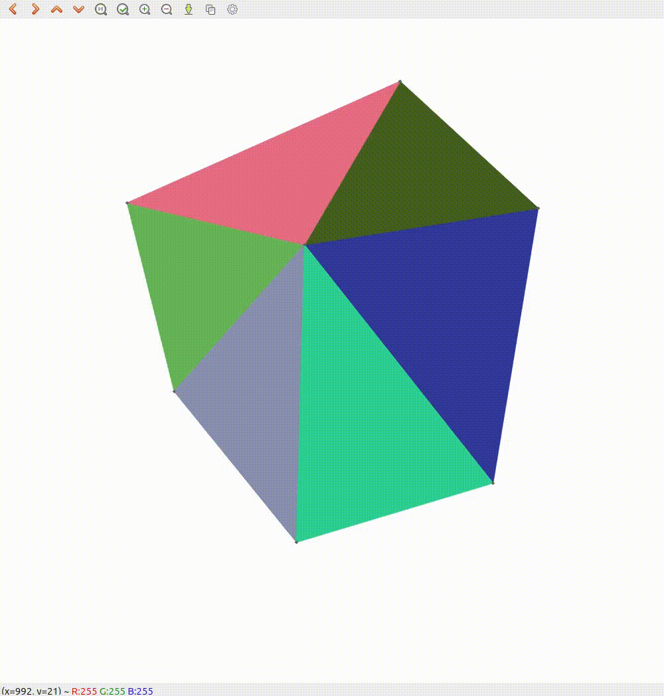

# DelaunayVoronoiCpp

A C++ implementation of the Delaunay Triangulation algorithm and Voronoi Diagram construction. Delaunay Triangulation uses the Bowyer-Watson method.

## Demo

**Delaunay Triangulation & Voronoi Diagram**

<p float="left">
  
  
</p>


**Centroid Voronoi Diagram**


**Find the Nearest Vertex**
You can efficiently find the vertex of the Delaunay triangulation that is nearest to a given point. This allows you to quickly determine which Voronoi region the point belongs to.


<p float="left">
  
  
</p>

## Installation

### Prerequisites

Ensure you have the following installed:

- **CMake**
- **YAML-CPP library** (`libyaml-cpp-dev`)
- **OpenCV library** (`libopencv-dev`)
- **C++ Compiler** (supporting C++20 or later)

### Installation Steps

1. **Update Package Lists**

   ```bash
   sudo apt update
   ```

2. **Install Dependencies**

   ```bash
   sudo apt install cmake libyaml-cpp-dev libopencv-dev
   ```

3. **Clone the Repository**

   ```bash
   git clone https://github.com/KentaKato/DelaunayVoronoiCpp.git
   ```

4. **Build the Project**

   ```bash
   cd DelaunayVoronoiCpp
   mkdir build
   cd build
   cmake ..
   make
   ```

## Usage

After building the project, run the executable:

### Interactive Delaunay Triangulation and Voronoi Tessellation

```bash
cd build
./interactive_delaunay_voronoi
```

- **Add Vertex**: Click Left mouse button on the canvas to add a new vertex.
- **Find the Nearest Vertex**: Click Middle mouse button on the canvas to find the nearest vertex from the clicked point.
- **Keyboard Shortcuts**:
  - **`v`**: Toggle drawing of Voronoi Diagram.
  - **`c`**: Toggle drawing of circumcircles.
  - **`t`**: Toggle display of vertex coordinates.
  - **`s`**: Toggle display of super triangles.
  - **`z`**: Undo the last added vertex.
  - **`f`**: Toggle filling of triangles.
  - **`Esc`**: Exit.

### Centroid Voronoi Diagram

```bash
cd build
./centroid_voronoi
```

## License

This project is licensed under the MIT License.
